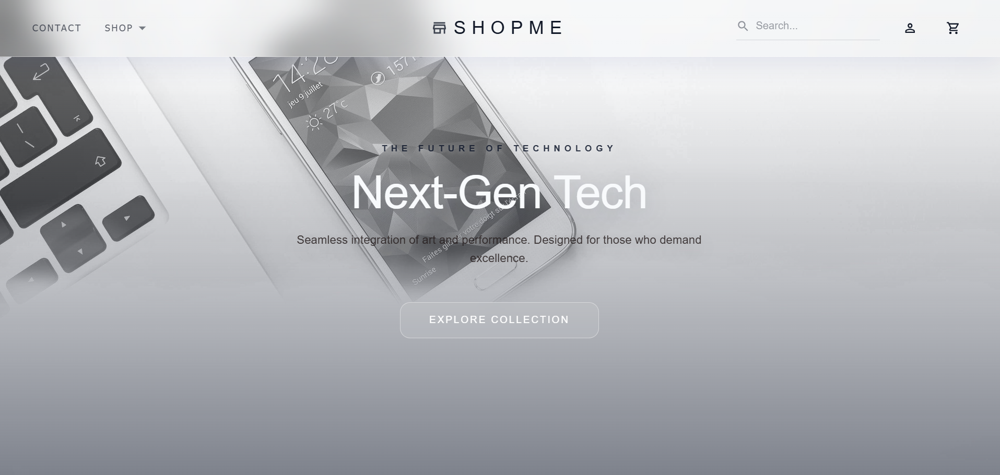
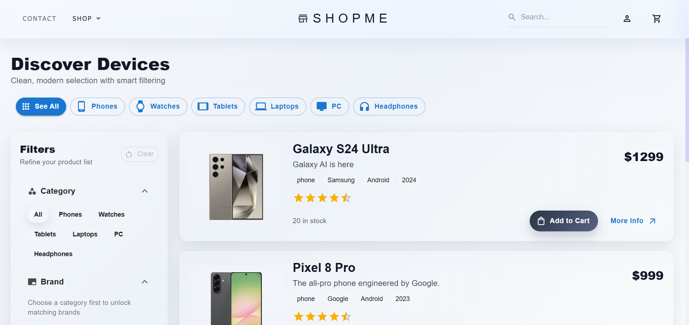
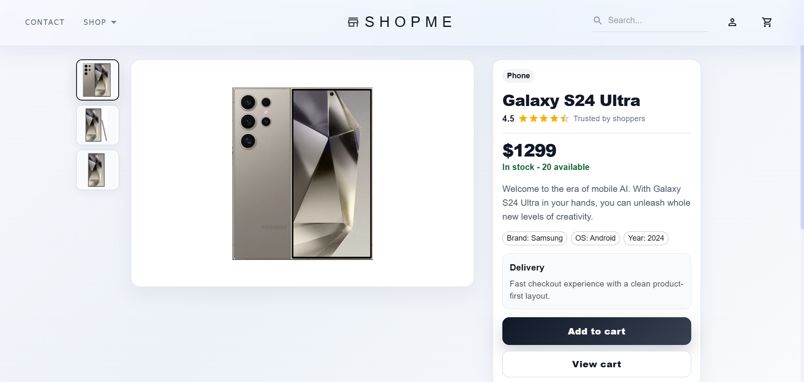
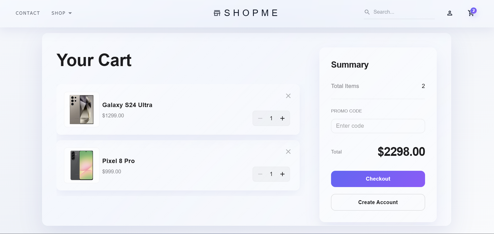
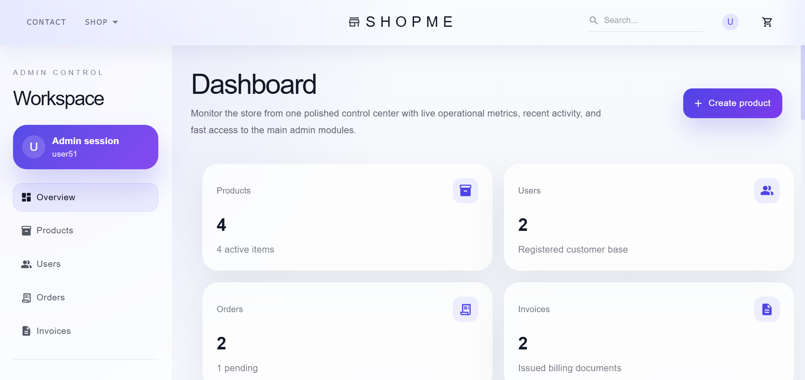
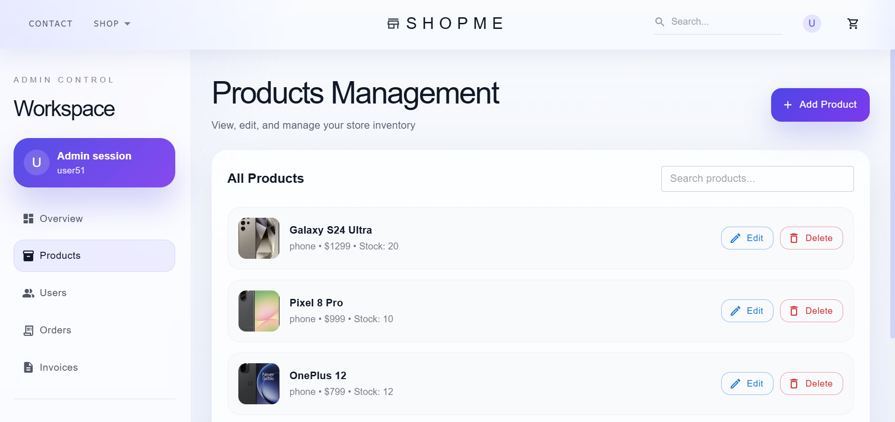

# SHOPME | Full-Stack MERN E-Commerce Platform

🔗 [Live Demo](https://shopme26.netlify.app/)

A robust, end-to-end e-commerce solution designed with a modern architecture, separating the client and server concerns. This platform provides a seamless shopping experience for customers and a powerful, intuitive administration panel for store management.

---

## 🌟 Overview
This project is a high-performance **MERN Stack** application. It features a modern SPA (Single Page Application) frontend and a secure RESTful API backend. The entire ecosystem is containerized using **Docker** for consistent development and deployment.

### Key Highlights:
* **Modular Architecture:** Built with reusable Custom Hooks, Views, and specialized Components.
* **UX-First Design:** Optimized with search debouncing, professional UI consistency, and smart loading states.
* **State Management:** Complex global state handling for carts, authentication, and user data.
* **Scalability:** Ready for growth with a clean NoSQL schema and containerized services.

---

## 🛠 Tech Stack

| Layer | Technology |
| :--- | :--- |
| **Frontend** | React 18, Vite, TypeScript (Partial), Redux Toolkit |
| **Backend** | Node.js, Express.js |
| **Database** | MongoDB |
| **Testing** | Jest, Supertest, MongoDB Memory Server |
| **DevOps** | Docker, Docker Compose |
| **Auth** | JWT, Secure Password Hashing, Email-based Reset Flow |
| **Tools** | Axios, React Router, Nodemailer, MUI |

---

## ✨ Features

### 👤 Customer Experience (Storefront)
* **Modern SPA:** Fast internal navigation and fully responsive design.
* **Product Discovery:** Dynamic catalog with advanced search (optimized with debouncing).
* **Smart Cart System:** Seamless synchronization logic between Guest carts (Local Storage) and User carts (Database) upon login.
* **Checkout Flow:** Streamlined process from cart to a dedicated "Thank You" page, ensuring order persistence and cart clearing.
* **Personal Dashboard:** Users can view order history and update profile details (Name, Email, Password).

### 🔑 Authentication & Security
* Role-Based Access Control (**RBAC**): Strict separation between regular Users and Admins.
* Secure Login/Registration.
* **Forgot Password:** Complete flow for password resetting via secure email links.

### 🛠 Administrative Tools (Admin Panel)
* **Centralized Dashboard:** Professional sidebar navigation for operational management.
* **Product CRUD:** Create, Read, Update, and Delete products without manual DB intervention.
* **Image Handling:** Normalized processing for product images (`image`, `images`, `productImages`).
* **Operational Efficiency:** Designed to eliminate manual ID searching by providing a clean, searchable interface.

---

## 🧪 Testing Strategy
To ensure reliability and data integrity, the backend includes a comprehensive testing suite:

* **Jest:** The primary testing framework for unit and integration tests.
* **Supertest:** Used for high-level abstraction of HTTP testing to validate API endpoints.
* **MongoDB Memory Server:** Provides a real MongoDB instance running in memory for isolated, fast, and reliable database testing without affecting the production/dev DB.

**Run Tests:**
```bash
# Inside the backend service
npm test

# Via Docker Compose
docker compose exec backend npm test
```
---

## 🏗 Project Structure & Logic
* **Error Handling:** Unified error-catching mechanisms with consistent success/error UI notifications.
* **Validation:** Robust form validations on both the frontend and backend.
* **Database Design:** Managed entities for Users, Products, Carts, Orders, and Invoices.

---

## 📦 Getting Started (Docker)

To run the entire stack (Frontend, Backend, and Database) locally:

1.  **Clone the Repository:**
    ```bash
    git clone [https://github.com/your-username/your-repo-name.git](https://github.com/your-username/your-repo-name.git)
    cd your-repo-name
    ```

2.  **Configure Environment Variables:**
    Configure Environment Variables: Follow the template provided in the .env.example file located in the root directory to set up your environment: 


    Backend: Create a .env file inside the /server folder and fill in the required values, including PORT, MONGO_URI, JWT_ACCESS_KEY, and email credentials (EMAIL, EMAIL_PASS). 


    Frontend: Create a .env file inside the /client folder and provide the necessary variables, such as VITE_BASE_BACK_URL, VITE_MAIL_LINK, and more.

3.  **Launch with Docker Compose:**
    ```bash
    docker-compose up --build
    ```

4.  **Access the App:**
    * Frontend: `http://localhost:5173`
    * Backend API: `http://localhost:5000`

---

## 📈 Project Status: **Active Development** 🏗️
The platform is currently being refined with ongoing improvements to logic and design. 
**Future Roadmap:**
- [ ] AI / LLM integration for smarter product discovery, search assistance, and user support flows.
- [ ] Enhanced Invoicing system with PDF generation.
- [ ] Expanded Unit Testing with Jest and Supertest.

---
## 📸 Screenshots

| Storefront - Home | Product Catalog | Product Details |
| :---: | :---: | :---: |
|  |  |  |
| **Shopping Cart** | **Admin Dashboard** | **Admin Management** |
|  |  |  |
---
**Developed with focus on quality and performance.**